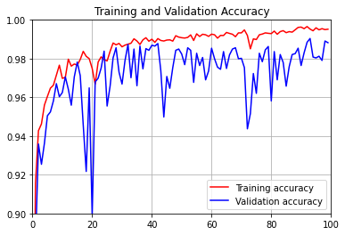
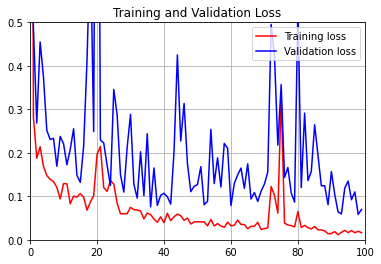

# Bangk!t Final Project - Tomato Diseases Detector
> Teams:
>   - Alvin Senjaya
>   - Jibril Hartri Putra
>   - Stella Linda Cyrilla

Using dataset https://www.kaggle.com/noulam/tomato

## Features

* Predict tomato leaf image diseases
* More information about treatment tomato diseases

## Model





You can download this model here
```
https://drive.google.com/file/d/1f1MKTJ627s5-qNmGhAIHNV4VzQu9NbTZ/view?usp=sharing
```

## Mobile version

Available to using mobile version, you can download it with this link

```
https://drive.google.com/file/d/1xljg3s_E9M50pNnVS98mLoO6LDKZy6Gm/view?usp=sharing
```

